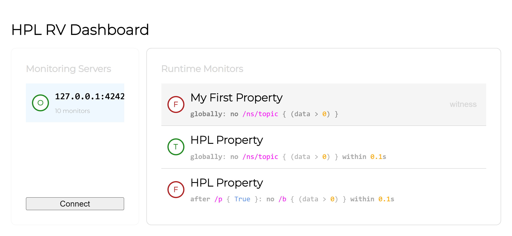

# HPL Runtime Verification

This project provides a tools from which you can build and manage runtime monitors based on [HPL properties](https://github.com/git-afsantos/hpl-specs/).

- [Installation](#installation)
- [Usage](#usage)
- [GitHub Features](#github-features)
- [Tooling](#tooling)

## Installation

Install this package with

```
pip install hpl-rv
```

## Usage

### Code Generation

This package provides a command line interface from which you can generate runtime monitors with a simple command.

```bash
# generating monitors from a specification file
hplrv gen -f my_spec.hpl
# generating monitors directly from properties
hplrv gen "globally: no /a"
# redirecting the output to a file
hplrv gen -o ./code.py "globally: some /b within 100ms"
```

When used as a library, you can generate Python code for a runtime monitor class with a few simple steps.
For example:

```python
from hplrv.gen import lib_from_properties
hpl_properties = ['globally: no (/a or /b)']
code: str = lib_from_properties(hpl_properties)
print(code)
```

### Monitoring Dashboard

This package also includes a web-based dashboard that enables live feedback from runtime monitors in a human-friendly format.



To execute the web server for this dashboard, run the `gui` command:

```bash
hpl-rv gui --host "127.0.0.1" --port 8080
```

Then, open the dashboard client with a web browser (e.g., on `http://localhost:8080`).

Through the dashboard, you can connect to runtime monitors to get live feedback.
To enable this feature, though, your runtime monitors should first start the feedback server.

For example, for code generated with `lib_from_properties()`, the main script where these monitors are included should follow roughly the following guidelines.

```py
from threading import Thread
from .generated_monitors import HplMonitorManager

man = HplMonitorManager()
man.live_server.host = '127.0.0.1'
man.live_server.port = 4242
thread: Thread = man.live_server.start_thread()
now: float = 0.0
man.launch(now)
try:
    # sleep or feed messages to the monitors; example:
    while True:
        sleep(1.0)
        now += 1.0
        man.on_timer(now)
except KeyboardInterrupt:
    pass
man.shutdown(now)
thread.join(10.0)
```

The call to `live_server.start_thread()` is what enables the dashboard to get live feedback.

## GitHub Features

The `.github` directory comes with a number of files to configure certain GitHub features.

- Various Issue templates can be found under `ISSUE_TEMPLATE`.
- A Pull Request template can be found at `PULL_REQUEST_TEMPLATE.md`.
- Automatically mark issues as stale after a period of inactivity. The configuration file can be found at `.stale.yml`.
- Keep package dependencies up to date with Dependabot. The configuration file can be found at `dependabot.yml`.
- Keep Release Drafts automatically up to date with Pull Requests, using the [Release Drafter GitHub Action](https://github.com/marketplace/actions/release-drafter). The configuration file can be found at `release-drafter.yml` and the workflow at `workflows/release-drafter.yml`.
- Automatic package building and publishing when pushing a new version tag to `main`. The workflow can be found at `workflows/publish-package.yml`.

## Tooling

This package sets up various `tox` environments for static checks, testing, building and publishing.
It is also configured with `pre-commit` hooks to perform static checks and automatic formatting.

If you do not use `tox`, you can build the package with `build` and install a development version with `pip`.

Assume `cd` into the repository's root.

To install the `pre-commit` hooks:

```bash
pre-commit install
```

To run type checking:

```bash
tox -e typecheck
```

To run linting tools:

```bash
tox -e lint
```

To run automatic formatting:

```bash
tox -e format
```

To run tests:

```bash
tox
```

To build the package:

```bash
tox -e build
```

To build the package (with `build`):

```bash
python -m build
```

To clean the previous build files:

```bash
tox -e clean
```

To test package publication (publish to *Test PyPI*):

```bash
tox -e publish
```

To publish the package to PyPI:

```bash
tox -e publish -- --repository pypi
```

To install an editable version:

```bash
pip install -e .
```
